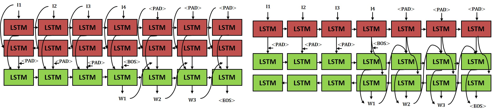

# Video Captioning
LSTM기반의 Seq2Seq Model을 사용한 Video Captioning

__많은 분들이 bilstm구현에 어려움을 겪으시는 것 같아 공지 드립니다. keras.Bidirectional 함수 제외 tf.basiclstmcell을 사용하는 다양한 tf 함수는 사용하셔도 무방합니다.__   
   
__본 과제는 하드웨어 성능을 많이 요구하는 과제로 개인 하드웨어 차이로 인해 생기는 성능 수치값 자체는 평가에 큰 영향을 미치지 않습니다. 보고서, 구현 등을 위주로 보니 수치값에 너무 연연해하지 않으셔도 됩니다. 하드웨어 사양이 낮으신 분들은 최대한 batch size, n_frames줄이고, Epoch줄여가면서 baseline, 신규 custom model간 성능 비교해주시면 됩니다.__   
   
__수정된 코드가 있으므로, LMS에서 다운받은 코드가 아닌 GitHub에서 코드를 재 다운로드 하여 사용해주세요__   
__지속적으로 GitHub readme를 업데이트 하고 있습니다. 오류가 생기면 우선 Readme를 한번 읽어보시고, 질문 주시면 감사하겠습니다.__

### 자주 질문하는 오류(이외에도 아래 readme 전체를 자세히 읽으시면 관련 내용이 있습니다)   

- GPU를 쓸 때는 각자의 Nvidia 그래픽 드라이버에 맞춰서 CUDA와 CuDNN을 설치해주셔야 합니다. 저는 CUDA 9.2를 사용했었습니다. 오류가 있으신분들은 10.0으로 변경 후 재시도 해보시기 바랍니다.   

- 환경 셋팅 시, 여러 개의 tensorflow가 설치되어 있는 분들이 있습니다. GPU가 있는 분들은 -gpu버전을 설치해주셔도 무방하지만, 없으신 분들은 requirement에서 "-gpu"를 -cpu로 변경하고 설치해주세요. 밑에까지 안읽고 그냥 설치하시는 분들이 많아 한번 더 명시해드립니다.   

- biLSTM구현 시 keras함수를 제외한 나머지 basicLSTMCell활용 tf함수는 사용하셔도 무방합니다. 제가 그린 그림에서 오히려 오해가 생기는 것 같아 재구성한 그림을 올려놓았습니다. 이전에 forward, backward cell간의 연결고리는 concat해서 넣어준다는 의미였는데 전혀 다른 의미로 받아들여져 오히려 각 cell간 의존성이 생기는 것으로 파악하신 분들이 계십니다. 아래 그림으로 파악해주세요.

- test과정 중(bleu_eval.py) XXX.avi 파일이 없다 뜨거나 pred값이 나오지 않을 경우, test_model.py의 batch size를 100으로 고정한 상태에서 다시 돌려주세요.   

- session start는 그냥 모델 시작 로그입니다. num steps를 확인하면 1epoch의 길이를 확인할 수 있으며 cuda error가 생기면 기존 tensorflow, 삭제 후 tensorflow cpu설치해주세요.   
 
- 어텐션 참고 링크 : (https://www.tensorflow.org/tutorials/text/image_captioning)
   

------------

# Requirement

### __0. 파이참 로딩__ ###   
파이참 로딩 때 간혹 빈 프로젝트를 생성하고, 코드를 엎어씌우는 과정에서 오류가 나시는 분들이 있습니다.
프로젝트를 따로 만들지 않고, Pycharm > File > Open 탭으로 프로젝트를 열거나 터미널 상에서 접근하시면 큰 오류가 없을 것 같습니다.

### __1. 필요 라이브러리 설치__ ###   
( Anaconda 환경 생성 후, 설치 진행)   
- python 3.6 / Tensorflow 1.15.0    
설치 과정 중 버전 오류가 있으신 분들은 python 3.6.1 ~ 3.6.12 버전을 설치해서 진행해보시기 바랍니다.
```
pip install -r requirements.txt
```
- Tensorflow는 GPU 유무에 따라 requirements 파일에서 "-gpu"를 삭제, 추가하실 수 있습니다.   

### __2. 학습 데이터 다운로드__ ###   

~~[다운로드 링크]()~~   

--> 이미 LMS로부터 받으신 분은 해당 zip파일 그대로 사용하시면 됩니다. 혹시나 LMS에 전체 데이터가 다 올라가지 않을까 염려되어 링크를 올려둔 것이니, 참고하시기 바랍니다.   
+) 데이터.zip파일의 용량은 약 2.24GB이며, 확인해보시고 문제 있으시면 담당조교에게 문의 바랍니다.   
+) 다운받으신 데이터는 data폴더 안에 풀어주시면 됩니다.

### __3. 수정해야 하는 파일들__ ###
blue_eval.py, model_train.py, model_test.py 세 가지 파일 내 본인 경로로 변경   

- 경로 설정 시, Window는 "\\\\" 를 Ubuntu에서는 "/"를 유의해서 사용해주세요.
- 각 모델 별 설정된 하이퍼 파라미터는 테스트 용으로 기입된 숫자이며, 절대 잘 되는 모델을 위한 하이퍼 파라미터가 아닙니다.본인 컴퓨터 사양에 맞춰 여러 번 실험해보고 최고의 성능을 내는 하이퍼 파라미터를 결정한 후, 실험에 사용하시기 바랍니다.   
- 코드를 실행할 때 너무 오래걸리거나 CPU, GPU용량이 부족할 경우 batch size를 줄여 돌리시기 바랍니다.   

------------

## Project Requirement
From (https://github.com/SidSong01/seq2seq_video2text)   

### __1. 다운받은 데이터를 data폴더로 이동__ ###


### __2. 학습진행__ ###   
  ```
  python model_train.py
  ```   
  
     
     
  logs폴더엔 Tensorboard용 데이터, save_model엔 checkpoint파일과 save_model~~.meta 등의 모델 파일이 존재합니다.   
  학습이 완료되면 파일을 꼭 확인하고, 만약 Test과정에서 모델을 로딩하지 못할 경우 checkpoint를 직접 수정하여 불러올 파일을 명시할 수 있습니다.   
  
### __3. 성능 확인__ ###   
  batch_size변수 100으로 고정해놓고 돌려주세요.

  ```
  python model_test.py
  ```
  final_output.txt파일 생성 여부 확인   
  
  
  ```
  python bleu_eval.py
  ```
  Bleu Score 확인   
    
### __4. Tensorboard 확인__ ###   

   학습 과정 중 일어난 Loss변화 또는 학습 변화를 확인하고 싶을 때는
   logs/train(test)폴더 안에 있는 tensorboard 파일로 변화율을 확인할 수 있음
   ```
   tensorboard --logdir=./logs/train(test)
   ```
   웹 브라우저에서 http://localhost:6006/ 으로 확인   
   
